# TrainHack Database Design

## Architecture Overview

TrainHack uses PostgreSQL as the system of record and Prisma as the TypeScript data-access layer. The schema is normalized to at least 3NF: identity, profile, content, attempts, progress, scoring, notifications, and logs are stored in separate tables with explicit foreign keys.

The design favors durable writes and predictable joins. High-read data such as course catalogs, challenge lists, notification counts, and leaderboard views should use Redis cache-aside with short TTLs or event-driven invalidation.

## ERD

```mermaid
erDiagram
  User ||--o| UserProfile : has
  User ||--o| UserSettings : has
  User ||--o| UserProgress : tracks
  User ||--o{ UserRole : assigned
  Role ||--o{ UserRole : contains
  Role ||--o{ RolePermission : grants
  Permission ||--o{ RolePermission : included
  User ||--o{ Session : opens
  Session ||--o{ RefreshToken : owns
  User ||--o{ PasswordResetToken : requests
  User ||--o{ EmailVerificationToken : verifies

  CourseCategory ||--o{ Course : groups
  Course ||--o{ CourseModule : contains
  CourseModule ||--o{ Lesson : contains
  Lesson ||--o{ LessonResource : links
  User ||--o{ LessonProgress : records
  Lesson ||--o{ LessonProgress : measured_by

  LabCategory ||--o{ Lab : groups
  Lab ||--o{ LabAttempt : runs
  User ||--o{ LabAttempt : starts
  Lab ||--o{ LabProgress : measured_by
  User ||--o{ LabProgress : records

  ChallengeCategory ||--o{ Challenge : groups
  Challenge ||--o{ ChallengeHint : has
  Challenge ||--o{ ChallengeFile : has
  Challenge ||--o{ ChallengeAttempt : attempted_as
  User ||--o{ ChallengeAttempt : starts
  Challenge ||--o{ FlagSubmission : receives
  User ||--o{ FlagSubmission : submits

  Quiz ||--o{ QuizQuestion : contains
  QuizQuestion ||--o{ QuizChoice : offers
  Quiz ||--o{ QuizAttempt : attempted_as
  QuizAttempt ||--o{ QuizAnswer : includes
  QuizQuestion ||--o{ QuizAnswer : answered_by
  User ||--o{ QuizAttempt : starts

  Team ||--o{ TeamMember : has
  User ||--o{ TeamMember : joins
  Team ||--o{ TeamInvitation : sends

  Level ||--o{ UserProgress : classifies
  User ||--o{ XPTransaction : earns
  Achievement ||--o{ UserAchievement : unlocks
  User ||--o{ UserAchievement : receives
  User ||--o{ Certificate : receives

  Leaderboard ||--o{ LeaderboardEntry : snapshots
  Notification ||--o{ UserNotification : delivered_as
  User ||--o{ UserNotification : receives
  User ||--o{ ActivityLog : causes
  User ||--o{ AuditLog : acts
```



## Relationship Rules

- Identity uses many-to-many RBAC through `UserRole` and `RolePermission`.
- Sessions cascade from users; refresh tokens cascade from sessions and are stored as hashes.
- Course, module, lesson, lab, challenge, quiz, team, achievement, and notification records use soft deletes where content may need retention.
- Attempts, submissions, progress, XP transactions, audit logs, and activity logs are append-friendly records and should not be hard deleted during normal operation.
- Challenge submissions may point to a team with `SetNull` so historical submissions survive team deletion.
- Categories use `Restrict` or `SetNull` depending on whether the child record should remain valid without the category.

## Index Recommendations

- `User.email`, `User.username`: unique authentication and profile lookup.
- `RefreshToken.tokenHash`, `PasswordResetToken.tokenHash`, `EmailVerificationToken.tokenHash`: secure token lookup.
- `Session.userId`, `Session.expiresAt`: session management and cleanup jobs.
- `Course.status + difficulty`, `Course.categoryId`: catalog filtering.
- `CourseModule.courseId + order`, `Lesson.moduleId + order`: ordered roadmap rendering.
- `LessonProgress.userId + lessonId`, `LabProgress.userId + labId`: idempotent progress updates.
- `Challenge.difficulty + status`, `Challenge.categoryId`: challenge listing.
- `FlagSubmission.challengeId + userId`, `FlagSubmission.createdAt`: solve history and rate limiting.
- `QuizAttempt.quizId + userId`, `QuizAnswer.attemptId + questionId`: grading and attempt history.
- `TeamInvitation.tokenHash`, `TeamInvitation.expiresAt`: invite acceptance and cleanup.
- `UserProgress.totalXp`, `LeaderboardEntry.leaderboardId + score`: leaderboard generation.
- `ActivityLog.userId + createdAt`, `AuditLog.actorId + createdAt`, `AuditLog.resource + resourceId`: investigations and admin history.
- `UserNotification.userId + readAt + createdAt`: notification inbox queries.

## Constraints

- UUID primary keys are used across domain tables.
- Junction tables use composite primary keys to prevent duplicate assignments.
- `@@unique` constraints enforce one progress record per user/content pair.
- `NOT NULL` fields protect required business data such as credentials, titles, statuses, and token expirations.
- Application-level validation should enforce check-like rules not currently expressible in portable Prisma schema, such as non-negative XP and percentage ranges.

## Migration Strategy

1. Develop schema changes in Prisma and run `npm.cmd run prisma:generate`.
2. Create migrations with `npx prisma migrate dev --name <change-name>`.
3. Review generated SQL before merge.
4. In CI, run `prisma migrate deploy` against an ephemeral PostgreSQL service.
5. In production, deploy backwards-compatible migrations before application code when possible.
6. For large tables, add nullable columns first, backfill in batches, then enforce `NOT NULL`.

## SQL DDL

Prisma is the source of truth. Generate SQL DDL from the schema with:

```bash
npx prisma migrate diff --from-empty --to-schema-datamodel prisma/schema.prisma --script
```

For a migration file:

```bash
npx prisma migrate dev --name initial_trainhack_database
```

## Performance

- Use cursor pagination for submissions, audit logs, activity logs, and notifications.
- Cache public catalogs and leaderboard responses in Redis.
- Recompute leaderboard snapshots asynchronously with BullMQ after XP transactions.
- Prefer `select` projections for API responses to avoid loading sensitive hashes.
- Keep write transactions tight when awarding XP, recording submissions, and updating progress.

## Security

- Store password hashes with Argon2 only.
- Store refresh, reset, invite, and verification tokens as SHA-256 hashes.
- Never return `passwordHash`, token hashes, or challenge `flagHash` from public APIs.
- Consider field-level encryption for sensitive audit metadata, IP addresses, and personally identifying profile data in regulated deployments.
- Use least-privilege PostgreSQL users for app, migration, and analytics workloads.

## Scalability And Archival

- Partition `FlagSubmission`, `QuizAttempt`, `QuizAnswer`, `ActivityLog`, and `AuditLog` by month once row counts become large.
- Archive expired sessions, revoked tokens, old notification deliveries, and stale lab attempts with scheduled jobs.
- Keep immutable XP transactions as the ledger; aggregate into `UserProgress` for fast reads.
- Move large challenge files to object storage and keep metadata plus checksums in PostgreSQL.
